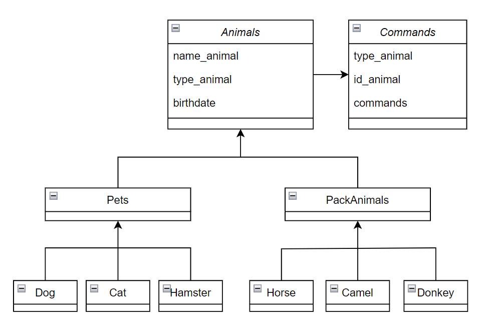

# Итоговая контрольная работа:
организовать систему учета для питомника "Human Friends".

## Операционные системы и виртуализация (Linux)
[Linux_Lesnikova_Lidiya_Andreevna_04.11.2023_4337.txt](Linux_Lesnikova_Lidiya_Andreevna_04.11.2023_4337.txt)

## Диаграмма классов:

## Работа с MySQL
[Скрипт создания БД](human_friends_script.sql)

## ООП и Java
Написать программу на Java, которая будет имитировать реестр домашних животных

[Программа](RegistryPets\Main.java)

Функционал:
1. Вывод всего реестра животных
2. Поиск животного в реестре (в т.ч. вывод списка команд, которые может выполнять животное)
3. Добавление нового животного в реестр
4. Изменение реквизитов животного в реестре (в т.ч. добавление новых команд у животного)
5. Удаление животного из реестра